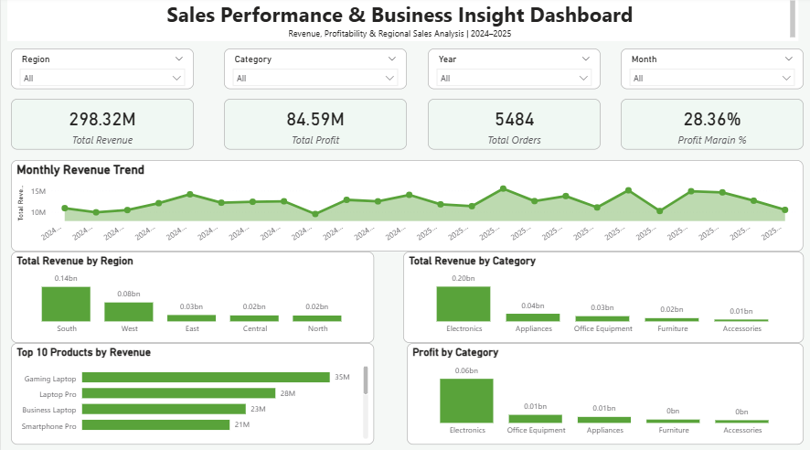
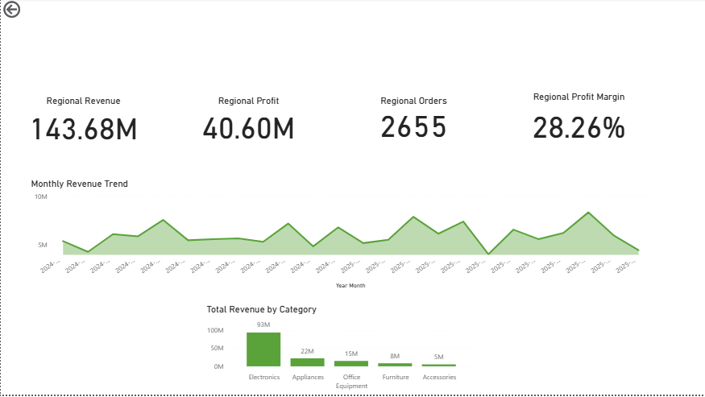

# 📊 Sales Performance & Business Insight Dashboard

An interactive Sales Performance and Business Insight Dashboard developed using **Power BI, Microsoft Excel Power Query, and DAX** to analyze revenue, profitability, orders, products, categories, and regional sales performance.

---

## 📌 Project Overview

This project transforms raw transactional sales data into an interactive business intelligence dashboard.

The workflow includes:

**Raw Sales Data → Excel Power Query → Data Cleaning → Power BI Data Model → DAX Measures → Interactive Dashboard → Regional Drill-through Analysis**

The dashboard helps users understand sales performance, identify profitable categories and products, compare regions, and analyze revenue trends over time.

---

## 🎯 Objectives

- Analyze overall sales and revenue performance
- Measure profitability and profit margins
- Identify top-performing products
- Compare sales performance across regions
- Analyze category-level revenue and profit
- Track monthly revenue trends
- Provide interactive filtering and regional drill-through analysis

---

## 🧹 Data Cleaning with Excel Power Query

The raw transactional dataset contained more than **5,000 sales records**.

Excel Power Query was used to:

- Remove duplicate records
- Handle missing Customer IDs
- Handle missing Quantity values
- Replace missing Discount values
- Standardize Customer IDs
- Standardize Product IDs
- Standardize Region IDs
- Convert order dates into proper date format
- Prepare the cleaned dataset for Power BI analysis

---

## 🗂️ Power BI Data Model

The Power BI model connects the following tables:

- **Sales**
- **Customers**
- **Products**
- **Regions**
- **Date Table**

Relationships were created between the sales fact table and the supporting dimension tables to enable interactive analysis.

---

## 🧮 DAX Measures

Key DAX measures developed for the dashboard include:

- Total Revenue
- Total Cost
- Total Profit
- Profit Margin %
- Total Quantity
- Total Orders
- Previous Month Revenue
- Monthly Revenue Growth %

### Example

```DAX
Total Revenue =
SUMX(
    Raw_Sales,
    Raw_Sales[Quantity] *
    Raw_Sales[Unit_Price] *
    (1 - Raw_Sales[Discount])
)
```

---

## 📸 Dashboard Preview

### Sales Dashboard



### Regional Detail


